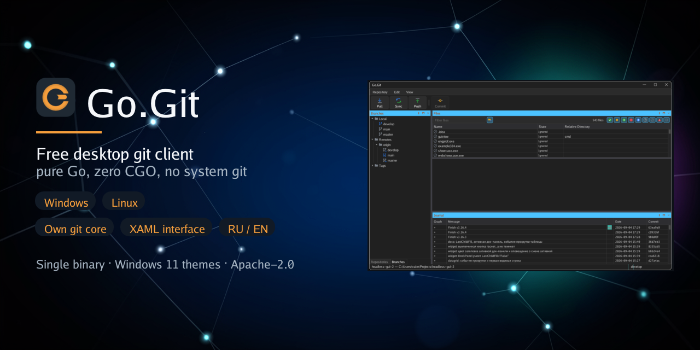

# Go.Git



[Русская версия](README.md)

A free desktop git client for Windows and Linux. The goal is to make everything
you can do with git from the console available through a comfortable visual
interface. An alternative to the paid SmartGit.

- Its own implementation of git in pure Go: no installed git is required.
- `CGO_ENABLED=0`, a single executable with all resources built in.
- Graphics engine [headless-gui/v3](https://github.com/oops1/headless-gui):
  the interface is described in XAML, the logic in Go, Windows 11 themes (dark and light, matching the system by default).
- Dock panels: repositories, branches, files, diff, commit log — any of them
  can be hidden, dragged to another edge, or torn off into a separate system
  window; the layout is remembered.
- Localization: Russian and English out of the box, any other language is a single JSON file.

## What 1.5.3 can already do

**Interface.** The menu and toolbar mirror SmartGit; the toolbar is configured
in a separate window and stored in `config.toml`. Dock panels:
repositories, branches, files, diff, commit log. Theme — light, dark, or
matching the system, with an accent from the OS settings; custom accent, background, field
and text colors are set in the settings. The built-in console executes a subset of
git commands with our own engine, without system git.

**Working with history.** Cloning over HTTPS, SSH, `git://` and from a local
path; fetch, push, pull and sync; remote management. Merge, rebase
(including interactive), cherry-pick, revert, reset, conflict resolution
with side selection and `rerere`. Bisect with good, bad and skip steps. Commit
log with a graph, incremental loading, filters by branch, author,
message, changed content (`-S`, `-G`) and path.

**Changes and the index.** The "Files" panel with the status of each file, filters,
stage, unstage and discard — for a whole file, by hunk or by individual lines. An index
editor with three sides: HEAD, index and working copy. Two-panel diff
with highlighting, `myers`, `patience` and `minimal` algorithms, rename detection,
built-in diff drivers from git for 27 languages. Stash with untracked
files and index preservation; `refs/stash` is compatible with git.

**Branches and working copies.** A branch tree with local, remote, tags, stash
and submodules; a divergence counter `↑3 ↓1` on a branch with its own remote; a "≡"
menu with sorting and grouping. Working copies (worktree), git-flow in the spirit of
SmartGit (Feature, Release, Hotfix, Support, Full and Light modes),
repository maintenance: `gc`, `repack`, `prune`, `fsck`, `count-objects`,
writing `commit-graph`.

**Submodules.** `.gitmodules` with relative URLs, init, update, sync, add,
remove, unregister and reset; recursion when switching branches via
`submodule.recurse` and descending into changed submodules on fetch and pull.

**Partial working copy.** `sparse-checkout` commands with cone mode
and partial clone `--filter=blob:none` with on-demand object download.

**Code investigation.** Blame with navigation through history, Investigate — history
of selected lines (`git log -L`) from the file list, from diff and from blame. Reading
`commit-graph` with generation numbers and changed-path filters speeds up
the log on long histories.

**Network and access.** Push reaches every `pushurl` of the remote repository, just
like git: a mirror does not fall behind, and the log names every address. HTTP proxy, git TLS settings, `extraHeader`,
`protocol.allow`, protocol v2 with a fallback to v0, shallow clone. Basic, Bearer, NTLM and Negotiate (Kerberos)
authentication — including through a proxy
with a CONNECT tunnel and binding to the server certificate.

**Secrets.** Credentials and SSH keys in an encrypted store: DPAPI on
Windows, Secret Service on Linux, a master password or a key file. System
stores are read too — the Windows Credential Manager and Secret Service,
without launching external helper programs. An unknown host key is shown
with its fingerprint and is remembered only after confirmation.

**Hooks.** `pre-commit`, `commit-msg`, `post-checkout`, `post-merge`,
`pre-rebase` and `pre-push` run the same way git runs them; the hook's
output is visible in the dialog and can be bypassed.

## User guide

How to add a repository, what every pane does, where the settings live and
what to look at when something goes wrong: [USER_GUIDE.md](USER_GUIDE.md)
(in Russian).

## What is still missing

Horizontal scrolling in the compare and conflict-resolution windows (waiting
on the engine), a compatibility matrix with different versions of git, and installers.
The order of work is in docs/RELEASE_PLAN.md.

## Building

You only need Go 1.26.

```bash
make build
```

```bash
go run ./cmd/gogit
```

Console-free Windows binary: `make build-windows`.

## Development

```bash
make check
```

Compatibility integration tests use system git as a reference and run
separately: `go test -tags oracle ./...`.

## License

Apache License 2.0, see [LICENSE](LICENSE).
