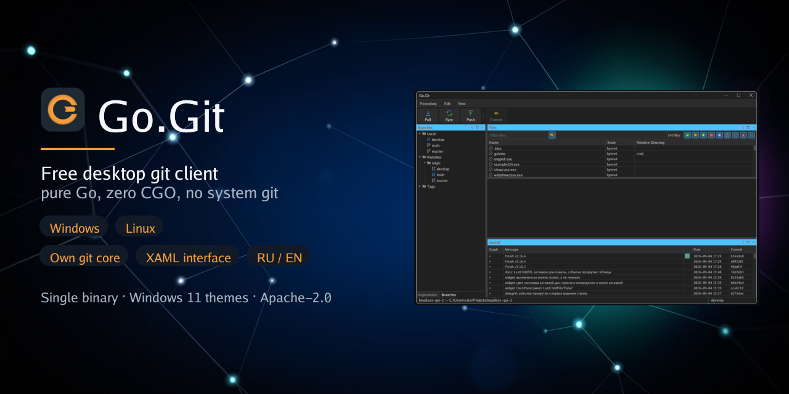

# Go.Git



Бесплатный настольный git-клиент для Windows и Linux. Цель — всё, что можно
сделать с git из консоли, делать через удобный визуальный интерфейс.
Альтернатива платному SmartGit.

- Собственная реализация git на чистом Go: установленный git не нужен.
- `CGO_ENABLED=0`, один исполняемый файл со всеми ресурсами внутри.
- Графический движок [headless-gui/v3](https://github.com/oops1/headless-gui):
  интерфейс описан в XAML, логика на Go, темы Windows 11 (тёмная и светлая, по умолчанию как в системе).
- Док-панели: репозитории, ветки, файлы, diff, журнал коммитов — любую можно
  скрыть, перетащить к другой стенке или отсоединить; раскладка запоминается.
- Локализация: русский и английский из коробки, любой другой язык — один JSON-файл.

## Что уже умеет 1.1

- Клонирование по HTTPS, SSH, `git://` и с локального пути; получение,
  отправка и синхронизация с удалённым репозиторием; управление remote.
- Учётные данные и SSH-ключи в зашифрованном хранилище: DPAPI на Windows,
  Secret Service на Linux, мастер-пароль или файл ключа. Неизвестный ключ
  хоста показывается с отпечатком и запоминается только после подтверждения.
- Список репозиториев с группами и рабочими копиями; узел репозитория
  раскрывается в дерево каталогов, выбор каталога фильтрует список файлов.
- Дерево веток: локальные, внешние, теги, stash; текущая ветка и ветка,
  на которую смотрит HEAD внешнего репозитория, помечены отдельными значками.
- Панель «Файлы»: состояние каждого файла (включая игнорируемые и неизменённые),
  фильтр по имени и по состояниям, stage, unstage, discard, коммит.
- Журнал коммитов с постраничной подгрузкой; выбор коммита показывает его файлы и diff.
- Двухпанельный diff с подсветкой изменённых строк.
- Слежение за репозиторием: правки, сделанные сторонним git или редактором,
  подхватываются автоматически; авто-fetch по таймеру показывает расхождение
  с upstream.
- Окно длительной операции с бесконечным прогрессом, логом действий и отменой.

## Чего в 1.1 ещё нет

Merge, rebase, cherry-pick, revert, reset, worktree, разрешение конфликтов
и построчный stage. Порядок работ — в docs/RELEASE_PLAN.md.

## Сборка

Нужен только Go 1.26.

```bash
make build
```

```bash
go run ./cmd/gogit
```

Windows-бинарь без консоли: `make build-windows`.

## Разработка

```bash
make check
```

Интеграционные тесты совместимости используют системный git как эталон и запускаются
отдельно: `go test -tags oracle ./...`.

## Лицензия

Apache License 2.0, см. [LICENSE](LICENSE).
